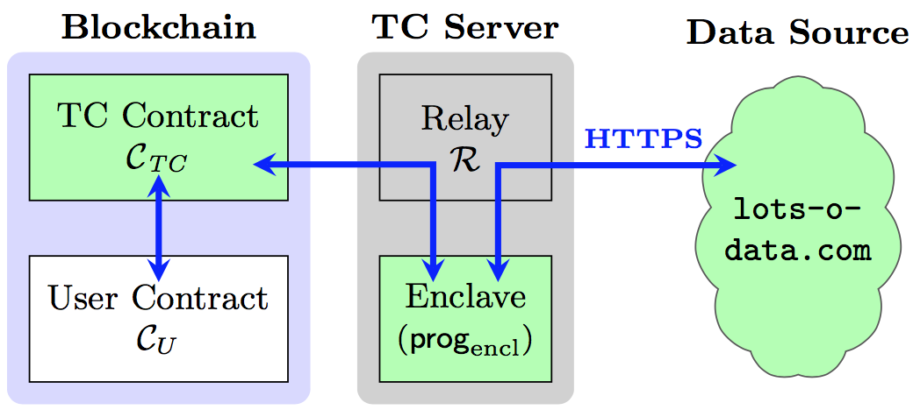
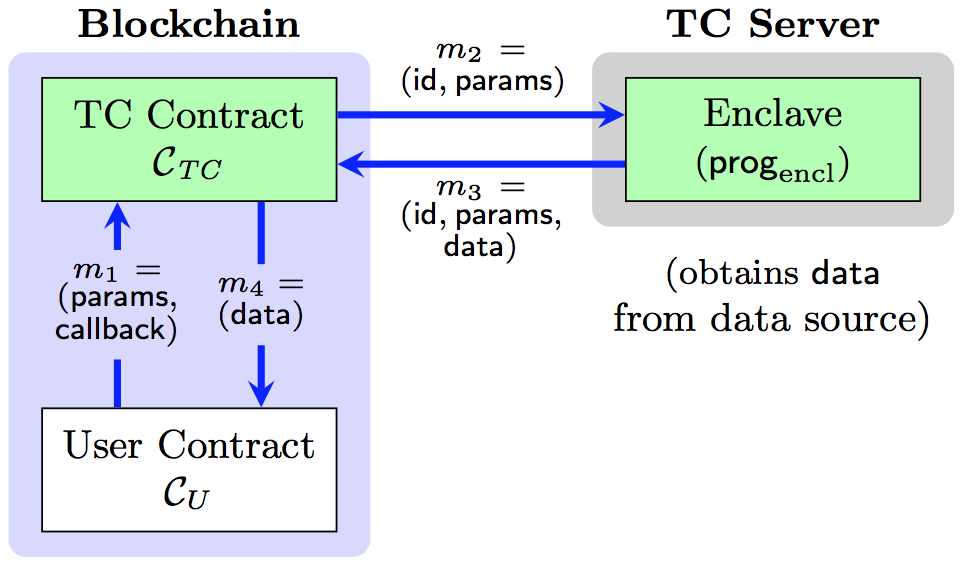

How Town Crier Works
====================

The Big Picture
---------------

Town Crier (TC) connects the authenticated data from HTTPS websites to smart contract ecosystem. TC works in a request-response fashion -- the client (your fantastic smart contract that needs data) submit *queries* to TC, and receives responses from TC.

   TC serves as a bridge between authenticated data on the web and the blockchain.

A Little Bit More Details
-------------------------

Behind the scenes, TC has two components that work together to serve queries from client contracts:

TC Contract
    *The frontend*. A smart contract deployed on the blockchain that is responsible to interface with client contracts.

TC Server
    *The backend*. A SGX-protected process that actually handles the queries picked up by the fronend. When the TC contract receives a query from a client contract, the TC server fetches the requested data from the website and relays it back to the requesting contract.

   TC Contract and TC Server.

Security of TC
--------------

Query processing happens inside an SGX-protected environment known as an **enclave**.
The requested data is fetched via a TLS connection to the target website that terminates inside the enclave.
SGX protections prevent even the operating system of the server from peeking into the enclave or modifying its behavior, while use of TLS prevents tampering or eavesdropping on communications on the network.

Town Crier can optionally ingest an *encrypted* query, allowing it to handle *secret query data*. For example, a query could include a password used to log into a server or secret trading data. TC's operation in an SGX enclave ensures that the password or trading data is concealed from the TC operator (and everyone else).
